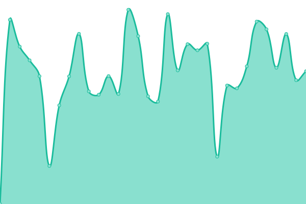
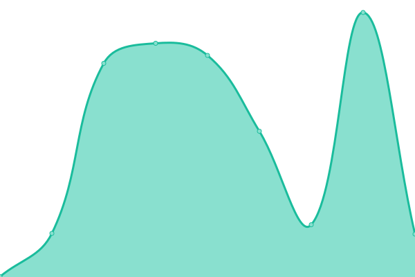

# [📈 Live Status](https://I-GUIDE.github.io/Status-Monitoring-with-Upptime): <!--live status--> **🟧 Partial outage**

This repository contains the open-source uptime monitor and status page for [NSF I-GUIDE](http://iguide.illinois.edu/), powered by [Upptime](https://github.com/upptime/upptime).

To add the url for monitoring, modify the ".upptimerc.yml" file to add the name and the url.

We use [Issues](https://github.com/I-GUIDE/Status-Monitoring-with-Upptime/issues) as incident reports, [Actions](https://github.com/I-GUIDE/Status-Monitoring-with-Upptime/actions) as uptime monitors, and [Pages](https://I-GUIDE.github.io/Status-Monitoring-with-Upptime) for the status page.

<!--start: status pages-->
<!-- This summary is generated by Upptime (https://github.com/upptime/upptime) -->
<!-- Do not edit this manually, your changes will be overwritten -->
<!-- prettier-ignore -->
| URL | Status | History | Response Time | Uptime |
| --- | ------ | ------- | ------------- | ------ |
|  [I-GUIDE](https://i-guide.io) | 🟩 Up | [i-guide.yml](https://github.com/I-GUIDE/Status-Monitoring-with-Upptime/commits/HEAD/history/i-guide.yml) | 

 807ms
     
 | 

<a href="https://I-GUIDE.github.io/Status-Monitoring-with-Upptime/history/i-guide">99.80%</a>
    

|  [I-GUIDE (Illinois Domain)](https://iguide.illinois.edu) | 🟩 Up | [i-guide-illinois-domain.yml](https://github.com/I-GUIDE/Status-Monitoring-with-Upptime/commits/HEAD/history/i-guide-illinois-domain.yml) | 

 583ms
     
 | 

<a href="https://I-GUIDE.github.io/Status-Monitoring-with-Upptime/history/i-guide-illinois-domain">99.88%</a>
    

|  [I-GUIDE JupyterHub Platform](https://jupyter.iguide.illinois.edu/hub/login) | 🟥 Down | [i-guide-jupyter-hub-platform.yml](https://github.com/I-GUIDE/Status-Monitoring-with-Upptime/commits/HEAD/history/i-guide-jupyter-hub-platform.yml) | 

 275ms
     
 | 

<a href="https://I-GUIDE.github.io/Status-Monitoring-with-Upptime/history/i-guide-jupyter-hub-platform">50.78%</a>
    

|  [I-GUIDE Platform User Environment](https://platform.i-guide.io) | 🟩 Up | [i-guide-platform-user-environment.yml](https://github.com/I-GUIDE/Status-Monitoring-with-Upptime/commits/HEAD/history/i-guide-platform-user-environment.yml) | 

 229ms
     
 | 

<a href="https://I-GUIDE.github.io/Status-Monitoring-with-Upptime/history/i-guide-platform-user-environment">100.00%</a>
    

|  [I-GUIDE Platform Neo4J example API (connected-graph)](https://backend.i-guide.io/api/connected-graph) | 🟥 Down | [i-guide-platform-neo4-j-example-api-connected-graph.yml](https://github.com/I-GUIDE/Status-Monitoring-with-Upptime/commits/HEAD/history/i-guide-platform-neo4-j-example-api-connected-graph.yml) | 

 348ms
     
 | 

<a href="https://I-GUIDE.github.io/Status-Monitoring-with-Upptime/history/i-guide-platform-neo4-j-example-api-connected-graph">100.00%</a>
    

|  [I-GUIDE Platform Login Mini Backend](https://platform.i-guide.io:8443) | 🟩 Up | [i-guide-platform-login-mini-backend.yml](https://github.com/I-GUIDE/Status-Monitoring-with-Upptime/commits/HEAD/history/i-guide-platform-login-mini-backend.yml) | 

 214ms
     
 | 

<a href="https://I-GUIDE.github.io/Status-Monitoring-with-Upptime/history/i-guide-platform-login-mini-backend">100.00%</a>
    

<!--end: status pages-->

[**Visit our status website →**](https://I-GUIDE.github.io/Status-Monitoring-with-Upptime)

## 📄 License

- Powered by: [Upptime](https://github.com/upptime/upptime)
- Code: [MIT](./LICENSE) © [Anand Chowdhary](https://anandchowdhary.com), supported by [Pabio](https://pabio.com)
- Data in the `./history` directory: [Open Database License](https://opendatacommons.org/licenses/odbl/1-0/)
